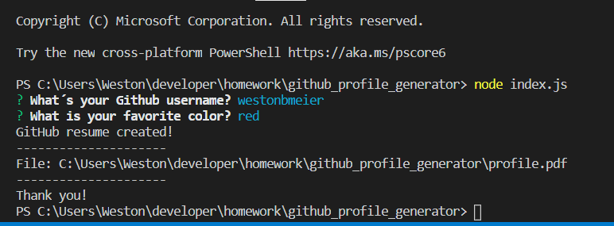

## Github Profile Generator ##
AS A product manager

I WANT a developer profile generator

SO THAT I can easily prepare reports for stakeholders

## Why it exists ##
When preparing a report for stakeholders, it is important to have up-to-date information about members of the development team. Rather than navigating to each team member's GitHub profile, a command-line application will allow for quick and easy generation of profiles in PDF format.

## Application ##
Using node.js you will be able to submit your github username and choose a preferred color to generate a PDF of your github profile. It is a quick and practical way to access the information in your github. 

It will show the following: 
-The profile picture used for your github profile. 
-Your username 
-Company
-Location
-Repositories 
-Friends and followers
and a link to your github page.

## Deployed Application ##

https://westonbmeier.github.io/github_profile_generator/

## Gif and screenshots ##

